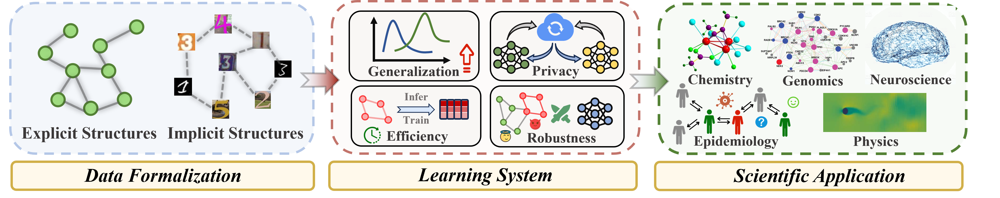
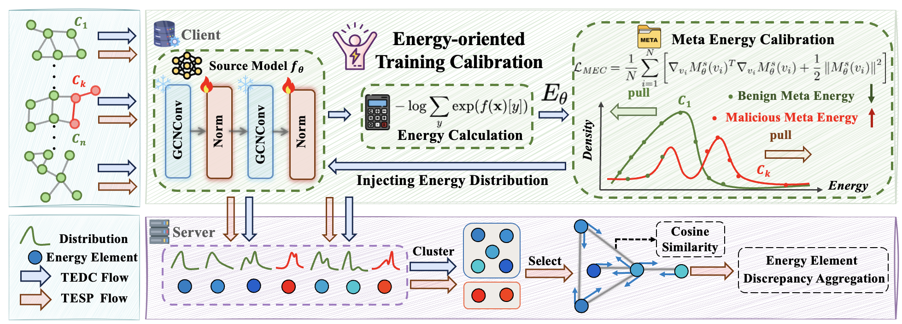
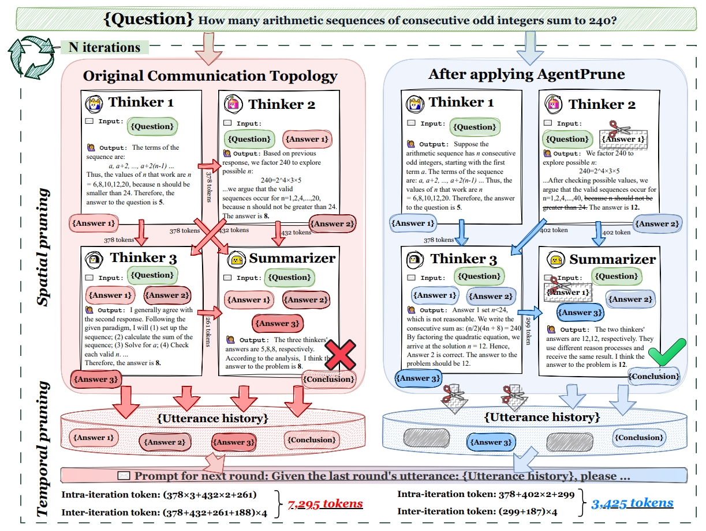








My name is Man Zhang，a 3th-year undergraduate student at Wuhan University CS, working closely with [Mang Ye](https://scholar.google.com/citations?user=j-HxRy0AAAAJ&hl=zh-CN) 

 🌟 I'm actively applying for a Ph.D. or Master position in 2026 Fall!  

# 🔎 Research 
<!-- "All things are interconnected, this is the essence of nature."  

<dt style="text-align: center; margin: 0; padding: 0;">
  
</dt>

I am passionate about modeling the relationships among all points (*e.g.*, nodes, tokens, or agents). My current research interests focus on three key areas:

a) (Multimodal) Large Language Models (LLMs), Large Reasoning Models (LRMs), LLM-based Multi-Agent System (MAS)

b) AI for Science: Genomics, Physics and Chemistry...

c) Trustworthy (Graph) Learning

 -->

# 🔥 News

<!--

<ul>
  <li><em>2025.04:</em> 🎉 One co-first authored paper: <strong>LoRASculpt </strong> (MLLM visual instruction tuning) was selected as an <strong class="co-first">Oral Presentation (Top 3.3%)</strong> at <strong>CVPR 2025</strong>. Thanks to all collaborators!</li>
  <li><em>2025.02:</em> 🎉 Three papers accepted by <strong>CVPR 2025</strong> on fine-tuning and applications of <strong>Multimodal Large Language Models (MLLM)</strong>. Thanks to all collaborators! See you in Nashville.</li>
  <li><em>2024.02:</em> I serve as a reviewer for <strong>NeurIPS 2025</strong>.</li>
  <li><em>2025.01:</em> 🎉 Two papers were accepted by <strong>ICLR 2025</strong>. See you in Singapore.</li>
  <li><em>2024.12:</em> 🎉 One paper was accepted by <strong>AAAI 2025</strong>.</li>
  <li><em>2024.12:</em> I serve as a reviewer for <strong>ICML 2025</strong>.</li>
  <li><em>2024.11:</em> 🎈I was honored with <strong>Lei Jun Excellence Scholarship</strong> ~ <strong>100k</strong> (The <strong><u>Highest</u></strong> Scholarship at Wuhan University, <strong><u>Top-4</u></strong> among All Undergraduates, Award Rate ~ <strong>0.01%</strong>)</li>
  <li><em>2024.11:</em> I serve as a reviewer for <strong>CVPR 2025</strong>.</li>
  <li><em>2024.09:</em> 🎉 Two papers were accepted by <strong>NeurIPS 2024</strong>. See you in Vancouver.</li>
  <li><em>2024.08:</em> Organize a tutorial at <strong>KDD 2024</strong> in Barcelona on 25th, come if you are interested in epidemics + GNN!</li>
  <li><em>2024.08:</em> I serve as a reviewer for <strong>ICLR 2025</strong>.</li>
  <li><em>2024.06:</em> 🎉 One paper is accepted by <strong>TPAMI</strong>, congrats to all collaborators!</li>
  <li><em>2024.05:</em> I serve as a reviewer for <strong>NeurIPS 2024</strong>.</li>
  <li><em>2024.05:</em> 🎉 Our survey about GNNs in Epidemic Modeling is accepted by <strong>KDD 2024</strong>. See you in Barcelona!</li>
  <li><em>2024.05:</em> 🎉 One paper about self-supervised graph learning was accepted by <strong>ICML 2024</strong>. See you in Austria!</li>
  <li><em>2024.04:</em> 🚀 Explore our pre-print: a deep look at using Graph Neural Networks in Epidemic Modeling. Check our collected <a href="https://github.com/Emory-Melody/awesome-epidemic-modeling-papers">paper list</a>.</li>
  <li><em>2024.02:</em> I serve as a reviewer for <strong>ACM MM 2024</strong>.</li>
  <li><em>2024.02:</em> I serve as a reviewer for <strong>ECCV 2024</strong>.</li>
  <li><em>2023.12:</em> A paper was accepted to <strong>AAAI 2024</strong>. See you in Vancouver.</li>
  <li><em>2023.11:</em> I serve as a reviewer for <strong>CVPR 2024</strong>.</li>
  <li><em>2023.11:</em> 🚀 We thoroughly explore three core research areas in federated learning: generalization, robustness, and fairness. Don't hesitate to utilize our <a href="https://github.com/WenkeHuang/MarsFL">benchmarking codes</a> for your own research goal!</li>
  <li><em>2023.10:</em> I attended China National Computer Congress (CNCC) and was awarded the honor of CCF (China Computer Federation) Elite Collegiate Award (102 Students nation-wide).</li>
  <li><em>2023.10:</em> I won the National Scholarship for the second time (0.2% nation-wide), and was selected the Pacemaker to Merit Student (Award Rate: 60/59774=0.1%).</li>
  <li><em>2023.08:</em> we attended <em>the 32nd international joint conference on artificial intelligence (<strong>ijcai</strong>)</em> and presented our work in macao.</li>
</ul>

-->

 

# 📃 Selected Publications ([Full List](https://scholar.google.com/citations?user=pB8zP9UAAAAJ))
<!--

**&dagger; Equal Contribution**   

<dl>
  <dt>
</dt>
  <dd><a href="https://openreview.net/forum?id=5Jc7r5aqHJ"><strong>	
Energy-based Backdoor Defense Against Federated Graph Learning
</strong></a></dd>
<dd><strong><strong>Guancheng Wan</strong>&dagger;</strong>, Zitong Shi&dagger;, Wenke Huang&dagger;, Guibin Zhang, Dacheng Tao, Mang Ye</dd>
<dd> <strong class="co-first"><i>Oral Presentation (Top 1.8%)</i></strong> in International Conference on Learning Representations (<strong>ICLR</strong>), 2025</dd>

</dl>

<dl>
  <dt>
</dt>
  <dd><a href="https://openreview.net/forum?id=LkzuPorQ5L"><strong>	
Cut the Crap: An Economical Communication Pipeline for LLM-based Multi-Agent Systems
</strong></a></dd>
<dd>Guibin Zhang, Yanwei Yue, Zhixun Li, Sukwon Yun, <strong>Guancheng Wan</strong>, Kun Wang, Dawei Cheng, Jeffrey Xu Yu, Tianlong Chen</dd>
<dd>International Conference on Learning Representations (<strong>ICLR</strong>), 2025</dd>

</dl>

-->

<!--
# 📝 Manuscripts

- **Rethink GraphODE Generalization within Coupled Dynamical System**  
**Guancheng Wan**, Zijie Huang, Wanjia Zhao, Xiao Luo, Yizhou Sun, Wei Wang  

- **Epidemiology-Aware Neural ODE with Continuous Disease Transmission Graph**  
**Guancheng Wan**, Zewen Liu, Xiaojun Shan, Max S.Y. Lau, B. Aditya Prakash, Wei Jin  

- **Keeping Yourself is Important in Downstream Tuning Multimodal Large Language Model**

- **Protein Large Language Models: A Comprehensive Survey**

-->
# 🎡 Service
<!--
## Program Chair

- [FedKDD 2025 Workshop@KDD 2025](https://fedkdd.github.io/fedkdd2025/)

## Conference Committee Member
- Reviewer for ICML'2025, ICLR'2025, NeurIPS'2024/2025, AISTATS'2025
- Reviewer for CVPR'2024/2025, ICCV'2025, ECCV'2024
- Reviewer for AAAI'2025, IJCAI'2025, ACM MM'2024/2025

##  Journal Reviewer
- IEEE TIFS, TIP, TKDE, TNNLS
- ACM TKDD
- Pattern Recognition (PR)
- Data-centric Machine Learning Research (DMLR)

 

-->

# 🎖 Scholarships and Honors
<!--

- *2024.11* **Lei Jun Excellence Scholarship** (**<u>雷军卓越奖学金</u>**) **~100k** (The **<u>Highest</u>** Scholarship at Wuhan University, **<u>Top-4</u>** among All Undergraduates, Award Rate: 10/65000+ ~ **0.01%**)  *Wuhan University*

- *2023.09* **National Scholarship** **(<u>Twice</u>)** (**<u>国家奖学金</u>**) (Award Rate: <strong>0.2% nation-wide</strong>) *Ministry of Education, China* 

- *2022.09* **National Scholarship** (**<u>国家奖学金</u>**) (Award Rate: <strong>0.2% nation-wide</strong>) *Ministry of Education, China* 

- *2024.10* **Luojia Undergraduate Innovation Research Fund** (首批珞珈本科生研究基金) ~50k (4 Students department-wide)  *Wuhan University*

- *2024.06* **Lei Jun Computer Innovation and Development Fund** and  **Research Fund** (雷军创新发展基金、雷军研究基金) (3 Students department-wide)  *Wuhan University*

- *2024.06* <a href="https://scholarship2024.sensetime.com/cn/">**SenseTime Scholarship**</a> (商汤奖学金) ~20k (**25 Students nation-wide**) *SenseTime*

- *2024.04* <a href="https://mp.weixin.qq.com/s/zdx8hH8-g0FScgZvkYQRnw">**CS Pioneer**</a> (计科先锋年度人物) (10 Students department-wide)  *Wuhan University*

- *2023.10* **CCF (China Computer Federation) Elite Collegiate Award** (CCF优秀大学生) (102 Students nation-wide) *China Computer Federation*

- *2023.10* **Pacemaker to Merit Student** (三好学生标兵) (Award Rate: 60/65000+ ~ <strong>0.1%</strong>) *Wuhan University*

 

-->
# 📖 Educations

  

    

      <strong>2022.09 - 2026.06</strong> 
      Undergraduate, School of Computer Science, Wuhan University 
    

    

      
    

  

